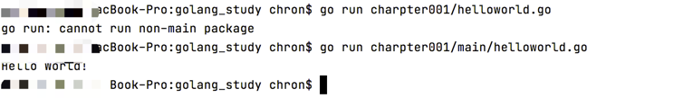

# golang_study
个人学习
### 1. 学习golang基本语法    2022-03-31
  #### a. 配置开发环境
       > golang包下载与安装  https://golang.google.cn/dl/
       > golang环境配置 配置gopath、gobin、goroot
       > 下载开发工具goland  https://www.jetbrains.com/go/

  #### b. helloword.go
  ** 必须要有main文件夹才能运行go run 命令 **
  

